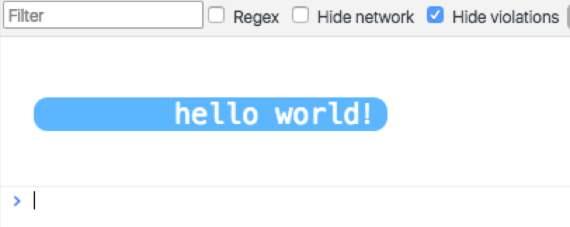

# log-style

**code:**
```
log.style('hello world！', {
    'color': '#ffffff',
    backgroundColor: '#3fb5ff',
    fontSize: '20px',
    'padding-left': 100,
    'border-radius': '10px',
    'line-height': 100
});
```

**view**

